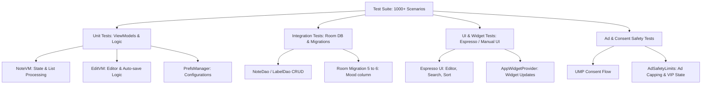

# 📋 Another Notes App — Test Cases Specification (QC Hand-off)

This document outlines the comprehensive test plan covering all layers of the application: **Unit Testing**, **Room Database Integration Testing**, **Ad Integration & Safety Testing**, and **UI/Widget/UX Flow Testing**. 

---

## 📌 1. Test Architecture & Coverage Overview

---

## 2. Test Cases Matrix

### 📂 Module A: Core Database & Migration (Integration)
These tests ensure database integrity, offline capability, and seamless updates without data loss.

| TC ID | Category | Test Scenario | Expected Result |
| :--- | :--- | :--- | :--- |
| **DB-001** | Room CRUD | Insert a standard text note | Note is saved in Room, returns a valid primary key, and appears in queries. |
| **DB-002** | Room CRUD | Insert a checklist note with multiple items | Note is saved with correct JSON structure in checklist items. |
| **DB-003** | Room CRUD | Delete note (move to trash) | Note status changes to `TRASHED`, excluded from active notes queries. |
| **DB-004** | Room CRUD | Restore note from trash | Note status reverts to `ACTIVE`, re-appears in active notes. |
| **DB-005** | Room CRUD | Empty trash folder | All notes with status `TRASHED` are permanently deleted from database. |
| **DB-006** | Room CRUD | Cascade delete labels | Deleting a label removes label references from note relations but keeps the notes intact. |
| **DB-007** | Migration | Migrate DB from schema v5 to v6 | Database upgrades successfully without losing existing notes. All existing notes receive default `mood` value of `0`. |
| **DB-008** | Backup | Backup database files | DB files copy successfully to external storage, validating integrity. |
| **DB-009** | Restore | Restore database from backup file | Original notes are recovered, hashes match pre-backup state. |
| **DB-010** | Migration | Migrate DB from schema v6 to v7 | `ALTER TABLE notes ADD COLUMN is_locked INTEGER NOT NULL DEFAULT 0` — existing notes upgrade unlocked by default. *(Added 2026-08-18 — schema was v5 as of this doc's last full review; current `NotesDb.VERSION = 8`.)* |
| **DB-011** | Migration | Migrate DB from schema v7 to v8 | Creates new `note_history` table (FK `noteId` → `notes.id`, `ON DELETE CASCADE`) + index on `noteId`. No existing note data touched. *(Added 2026-08-18)* |

---

### 📂 Module B: ViewModels & Core Business Logic (Unit)
These tests check state processing, data mapping, filtering, and the stable ID generation logic.

| TC ID | Category | Test Scenario | Expected Result |
| :--- | :--- | :--- | :--- |
| **VM-001** | NoteVM | Toggle layout mode list/grid/timeline | Layout mode updates in preferences and triggers list rebuilding. |
| **VM-002** | NoteVM | Rebuild list with stable IDs in timeline mode | Date headers get stable negative IDs: `-(dateLabel.hashCode().toLong() and 0xFFFFFFFFL) - 1000L - occurrence * 100_000L`. No duplicates or collisions. *(Corrected 2026-08-18 — formula was missing the `occurrence` disambiguation term added by FIX-M15/commit `107562e`; the pre-fix formula quoted here previously could actually collide, which is exactly the bug FIX-M15 fixed.)* |
| **VM-003** | NoteVM | Search notes by plain text keyword | Returns only notes whose title or content matches keyword (case-insensitive). |
| **VM-004** | NoteVM | Search notes by Vietnamese Unicode (diacritics) | Typing "tiếng việt" successfully matches notes containing "tiếng việt" or "Tiếng Việt". |
| **VM-005** | NoteVM | Sort notes by date added | Notes list is sorted chronologically descending. |
| **VM-006** | NoteVM | Sort notes alphabetically | Notes list is sorted lexicographically by title. |
| **VM-007** | EditVM | Word count logic on fast typing | Word count changes cleanly. Any active counter animations are cancelled instantly, returning exact word/char count. |
| **VM-008** | EditFrm | Autosave on fragment stop | `EditVM` has no `onCleared()` override — autosave is triggered by `EditFrm.onStop()` calling `viewModel.saveNote()`. Triggers database update with latest text content when the fragment stops (backgrounded or navigated away), not on ViewModel clear. *(Corrected 2026-08-18 — mechanism previously described here doesn't exist in code.)* |
| **VM-009** | EditVM | Mood badge selection | Setting mood value `1..5` saves the integer in the database note object. |

---

### 📂 Module C: Ads Integration & Safety Capping
Verifies ad delivery safety limits to prevent Google Play policy violations, check user experience, and VIP state logic.

> ⚠️ **Không audit lại được từ repo này (2026-08-18):** toàn bộ logic ads (AdSafetyLimits, cap 5000ms, VIP bypass, UMP flow) nằm trong thư viện ngoài closed-source `com.roy.sdkadbmob.AdManager` — repo hiện tại không còn source code của các con số/behavior này (xem `doc/memory_leak.md`). Các con số dưới đây (5000ms, session cap...) không thể xác nhận còn đúng, chỉ giữ lại như spec kỳ vọng cần test tay qua QA/behavior thật của SDK.

| TC ID | Category | Test Scenario | Expected Result |
| :--- | :--- | :--- | :--- |
| **AD-001** | Init | App Open preloads during cold start | App Open ad request starts immediately during splash. |
| **AD-002** | Lifecycle | ProcessLifecycleObserver: App goes to background and foreground | App Open ad displays on resume, unless disabled by safety constraints. |
| **AD-003** | Safety | App Open cold start protection | Ad safety flags skip showing the App Open ad on cold starts to prevent overlapping splash. |
| **AD-004** | Safety | VIP member bypass | If `isVIPMember == true`, all banner, interstitial, and app open loads/shows are bypassed (zero ad requests). |
| **AD-005** | Safety | Minimum duration between ads | If an ad was shown less than `5000ms` ago, subsequent fullscreen ad requests are rejected. |
| **AD-006** | Safety | Maximum ads per session | Ads count increments per show; shuts off requests once cap is reached. |
| **AD-007** | UMP | requestConsentInfoUpdate in EEA region | Displays Google's UMP consent form. Returns `canRequestAds` based on consent. |
| **AD-008** | UMP | Splash screen load timeout (5000ms) | If consent check or App Open ad load hangs (due to network error/code -1009), splash safety timer forces transition to `MainActivity`. |
| **AD-009** | Interstitial | Interstitial show on note creation | Tapping FAB requests interstitial; app creation screen opens immediately after ad is closed (or immediately if ad load fails). |

---

### 📂 Module D: UI, UX & Widget Flows (Espresso / Manual)
UI test scenarios covering the animations, layout transitions, and widgets.

| TC ID | Category | Test Scenario | Expected Result |
| :--- | :--- | :--- | :--- |
| **UI-001** | Animations | Pin/Unpin note from list | SpringItemAnimator moves card to top. Interrupted cuộn (fast scroll) resets card translations to `0f` cleanly without graphic artifacts. |
| **UI-002** | Empty State | Delete last note in list | Scale-in animation shows placeholder. Undo click cancels animation and hides placeholder cleanly. |
| **UI-003** | Mood Badge | Mood badge alignment in Timeline card | Emoji badge is rendered inside card with `32dp` paddingEnd. Text never clips or overlaps emoji. |
| **UI-004** | Swipe | Swipe note to delete | Swipe background color draws with semi-transparent `alpha = 200`. Spring bounce returns card to `0f` if threshold not reached. |
| **UI-005** | Dialogs | First-run Language Picker | Bottom sheet shows clearly (not transparent or blank) with standard dark background dim on Samsung OneUI (S24 Ultra). Tapping language saves locales and recreates app. |
| **UI-006** | Dialogs | Sort dialog rendering | Sort options bottom sheet shows clearly, fully interactive, options select correctly. |
| **UI-007** | Widgets | Add note widget to home screen | Widget renders title and content snippet. |
| **UI-008** | Widgets | Tap note widget | Opens `EditFrm` with the clicked note ID loaded. |
| **UI-009** | Widgets | Update note content | Widget updates text content dynamically via `AppWidgetProvider` broadcast. |

---

## 📌 3. QC Sign-off Requirements
Before deploying a new version to the Play Store production channel, QC must verify:
1. **No Data Loss:** 100% of notes are preserved after upgrading the app.
2. **Zero ANRs/Crashes:** Running Monkey tests (10,000 events) results in 0 crashes.
3. **Ads Cap Safety:** No duplicate or rapid succession ads shown (meeting AdSafetyLimits).
4. **Layout Integrity:** Visual verify that note cards do not retain scroll-induced offset translations on Samsung Galaxy devices.
